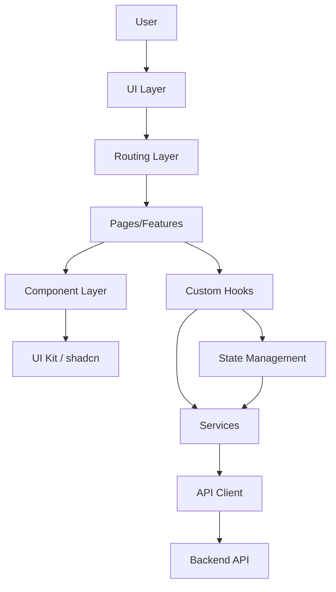
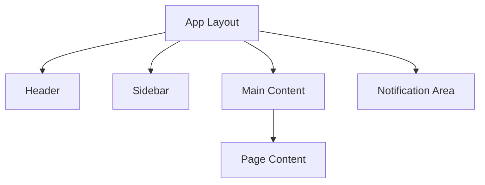
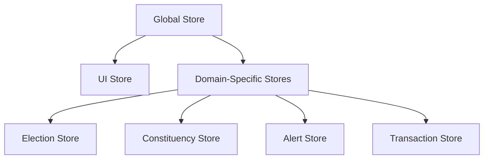
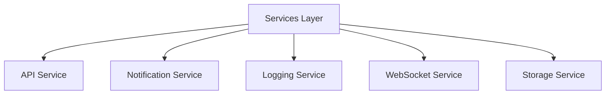
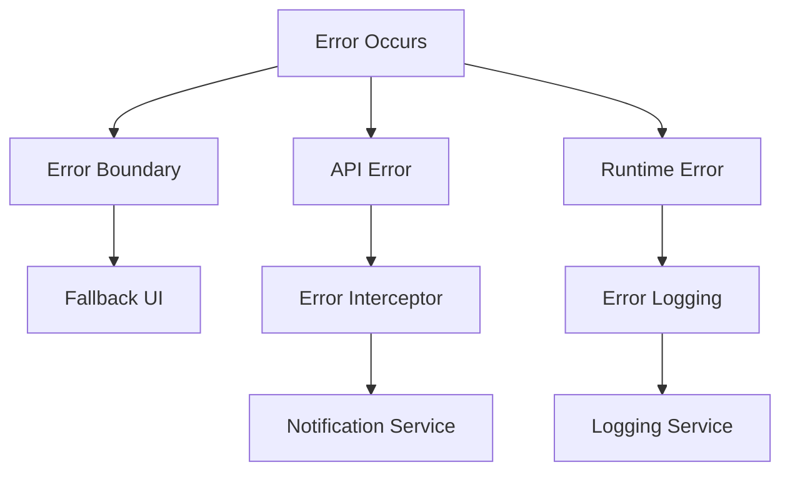
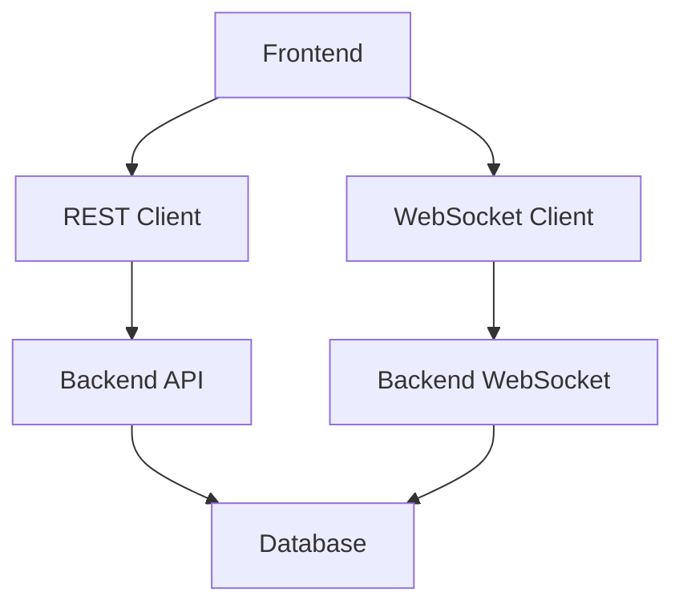
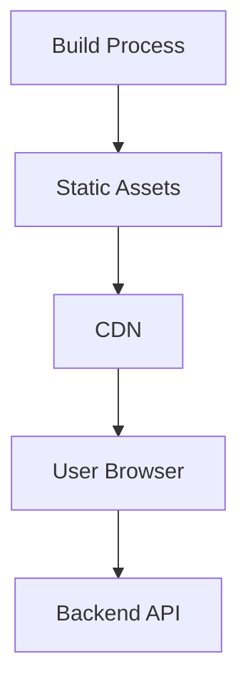

# Frontend Infrastructure Architecture

## Architecture Overview

The Election Monitoring System frontend will follow a modern React architecture with a focus on maintainability, scalability, and performance. The architecture is designed to support the specific needs of an election monitoring application, including real-time updates, data visualization, and secure access.

## Core Architectural Principles

1. **Component-Based Architecture**: UI elements are broken down into reusable components
2. **Unidirectional Data Flow**: Data flows down through components, actions flow up
3. **Separation of Concerns**: Clear boundaries between UI, state, and business logic
4. **Type Safety**: Comprehensive TypeScript typing throughout the application
5. **Composition Over Inheritance**: Components are composed rather than extended
6. **Single Responsibility**: Each component, hook, or service has a single responsibility

## Key Architectural Components

### 1. UI Layer

The UI layer is responsible for rendering the user interface and handling user interactions.

#### 1.1 Component Library (shadcn/ui)

We'll use shadcn/ui as our component library, which provides a set of accessible, customizable UI components built on Radix UI primitives and styled with Tailwind CSS 4.

Key aspects:
- Copy-paste implementation (not a dependency)
- Full customization capability
- Consistent design language
- Accessibility built-in
- Theming through CSS variables

#### 1.2 Layout System

The layout system will provide a consistent structure across the application:

- **App Layout**: The main container that structures the entire application
- **Header**: Contains app title, user info, and global actions
- **Sidebar**: Navigation menu with collapsible sections
- **Main Content**: The primary content area that changes based on the current route
- **Notification Area**: Toast notifications that appear when needed

### 2. Routing Layer

Routing will be handled by React Router, providing navigation between different sections of the application.

Key aspects:
- Route configuration with React Router 6
- Lazy-loaded route components for code splitting
- Route guards for protected routes
- Nested routes for complex page hierarchies
- URL parameter handling for dynamic content

### 3. State Management

State management will be implemented using Zustand, providing a simple yet powerful way to manage application state.

Key aspects:
- **Global Store**: Manages application-wide state
- **UI Store**: Manages UI-related state (sidebar collapse, theme, etc.)
- **Domain-Specific Stores**: Separate stores for different domain entities
  - **Election Store**: Manages election data
  - **Constituency Store**: Manages constituency data
  - **Alert Store**: Manages alert data
  - **Transaction Store**: Manages transaction data

### 4. Services Layer

The services layer provides an abstraction for external interactions and complex business logic.

Key aspects:
- **API Service**: Handles communication with the backend API
- **Notification Service**: Provides toast notifications and alerts
- **Logging Service**: Handles error logging and monitoring
- **WebSocket Service**: Manages real-time communication
- **Storage Service**: Handles local storage and persistence

### 5. API Client

The API client will provide a type-safe interface for communicating with the backend API.

Key aspects:
- Type-safe request and response handling
- Automatic error handling and retry logic
- Request/response interceptors
- Request cancellation
- Request caching

### 6. Custom Hooks

Custom hooks will encapsulate reusable logic and provide a clean interface for components.

Key categories:
- **Data Fetching Hooks**: For retrieving and managing API data
- **UI Hooks**: For handling UI-specific logic (e.g., form handling, modals)
- **Domain Hooks**: For domain-specific logic (e.g., election calculations)
- **Utility Hooks**: For common functionality (e.g., debounce, media queries)

## Cross-Cutting Concerns

### 1. Error Handling

A comprehensive error handling strategy will be implemented:

Key aspects:
- Global error boundary for catching unhandled errors
- API error handling with appropriate user feedback
- Error logging for monitoring and debugging
- Graceful degradation with fallback UIs

### 2. Internationalization (i18n)

While not immediately implemented, the architecture will support future internationalization:

Key aspects:
- Text externalization
- Language selection
- RTL support
- Date and number formatting

### 4. Accessibility

Accessibility will be a core consideration throughout the application:

Key aspects:
- WCAG 2.1 AA compliance
- Keyboard navigation
- Screen reader support
- Color contrast
- Focus management

### 5. Performance

Performance optimization will be built into the architecture:

Key aspects:
- Code splitting and lazy loading
- Memoization of expensive calculations
- Virtualized lists for large datasets
- Optimized re-rendering
- Asset optimization

## Technology Stack Details

### Core Technologies

- **React 18**: UI library with concurrent features
- **TypeScript 5.2**: Type-safe JavaScript
- **Vite 4.5**: Fast build tool and dev server
- **Tailwind CSS 4**: Utility-first CSS framework
- **shadcn/ui**: Component library built on Radix UI

### State Management

- **Zustand 4.4**: Simple state management
- **Immer**: Immutable state updates
- **Zod**: Runtime type validation

### Routing

- **React Router 6.20**: Client-side routing

### API Communication

- **Axios**: HTTP client
- **React Query**: Data fetching and caching
- **SWR**: Alternative data fetching strategy

### UI Enhancements

- **shadcn/ui Charts**: Chart components
- **tw-animate-css**: Animation utilities
- **Lucide React**: Icon library

### Development Tools

- **ESLint**: Code linting
- **Prettier**: Code formatting
- **Vitest**: Unit testing
- **Testing Library**: Component testing
- **Storybook**: Component documentation and testing

## Integration with Backend

The frontend will communicate with the backend through a RESTful API and WebSockets for real-time updates:

Key integration points:
- **Data Retrieval**: Fetching elections, constituencies, transactions, alerts
- **Real-time Updates**: WebSocket connections for live data
- **File Processing**: Monitoring file processing status

## Deployment Architecture

The frontend will be deployed as a static site, with the following architecture:

Key aspects:
- Static site generation with Vite
- CDN deployment for global availability
- Environment-specific configuration
- Cache control for optimal performance

## Security Considerations

Security will be a primary concern throughout the architecture:

Key aspects:
- Secure authentication and authorization
- CSRF protection
- XSS prevention
- Content Security Policy
- Secure data handling
- Input validation
- Sensitive data protection

## Future Extensibility

The architecture is designed to be extensible for future requirements:

Key extensibility points:
- Pluggable authentication providers
- Extensible dashboard widgets
- Customizable visualization components
- Modular feature architecture
- Extensible navigation system